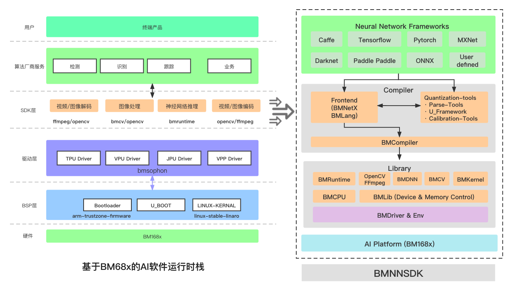

BMNNSDK
_______

BMNNSDK 是算能科技自研的软件包。
上图中提及的所有软件模块都包含在 BMNNSDK 中，
包括了 BMDriver, BMLib, BMCompiler, BMRuntime, Quantization & Calibration Tool, BMMultimedia(BM_OpenCV & BM_FFmpeg), BMCV,  Sophon Inference(SAIL).

具体信息请查看 BMNNSDK 入门文档：https://sophgo-doc.gitbook.io/bmnnsdk2-bm1684/

**BMDriver**
:是算丰 TPU 的驱动程序，将会通过 insmod 的方式安装到系统内核中，以源码形式提供。

源码位置：${BMNNSDK}/driver

**BMLib**
:提供了一些基础接口，用来控制 TPU 与主机的内存交互。

文档路径: ${BMNNSDK}/documents/BMLib_User_Guide.pdf

**BMCompiler & BMRuntime**
:目前多种模型编译工具，支持常见深度学习框架下模型的转换。其中：
bmnetc 可以将 Caffe 下训练生成的模型编译成 fp32_bmodel；
bmnett 可以将 TensorFlow 下训练生成的模型编译成 fp32_bmodel；
bmnetm 可以将 MXNet 下训练生成的模型编译成 fp32_bmodel；
bmnetp 可以将 PyTorch 下训练生成的模型编译成 fp32_bmodel；
bmnetd 可以将 Darknet 下训练生成的模型编译成 fp32_bmodel；
bmneto 可以将 ONNX 下训练生成的模型编译成 fp32_bmodel；
bmnpaddle 可以将 PaddlePaddle 下训练生成的模型编译成 fp32_bmodel；
bmnetu 可以将 Quantization & Calibration Tool 下生成的 int8_umodel 编译成 int8_bmodel；
bmruntime提供了一些应用接口，用来驱动 TPU 加载 bmodel 并进行模型推理。

文档路径: ${BMNNSDK}/documents/NNToolChain.pdf

**Quantization & Calibration Tool**
:该模块可以将 FP32 精度的模型转换成 INT8 精度的模型

文档1路径: ${BMNNSDK}/documents/Quantization-Tools-User_Guide.pdf

文档2路径: ${BMNNSDK}/documents/auto_calib_manual.pdf

**BMMultimedia**
:提供了一些应用接口，用来驱动 TPU 上的硬件单元进行图像和视频的编解码。

文档路径: ${BMNNSDK}/documents/Multimedia_Guide_zh.pdf

**BMCV**
:提供了一些应用接口，用来驱动 TPU 上的硬件单元进行张量计算和图像处理。

文档路径: ${BMNNSDK}/documents/BMCV_User_Guide.pdf

**SAIL**
:提供了一些高级接口，主要是对 BMRuntime、BMCV、BMdecoder 等运行时模块的封装。

文档路径：${BMNNSDK}/documents/Sophon_Inference_zh.pdf

**BMLang**
:BMLang 是一种面向 Sophon TPU 的上层编程语言，适用于编写高性能的深度学习、图像处理、矩阵运算等算法程序。

文档路径：${BMNNSDK}/documents/BMLang.pdf
