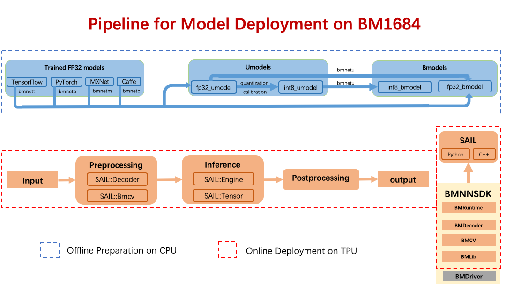

模型部署
________

模型部署包含两步：模型的离线编译和在线推理。
上图中包含的软件工具都包含在 BMNNSDK 中。

**a).模型离线编译**

模型的离线编译对应上图中蓝色虚线框中的内容。
这一过程的目的是把用户在各种框架下训练好的深度学习模型转换成我们定义的模型格式：bmodel。
目前， 算丰 TPU 包含了 FP32 和 INT8 两种类型的计算单元，因此 bmodel 也分为了 fp32_bmodel 和 int8_bmodel。
如上图中，经过 tensorflow 训练生成的 xxx.pb 模型可以通过 bmnett 中提供的接口生成 fp32_bmodel；
也可以先通过我们提供的脚本先生成 fp32_umodel，再通过量化校准工具生成 int8_umodel，最后通过 bmnetu 生成 int8_bmodel。
目前，我们已经支持了将 Tensorflow、Pytorch、Mxnet、Caffe 四种深度学习框架下训练生成的模型编译成 bmodel。
这一步骤的完成无需 TPU 的参与，因此是离线的。

**b).模型在线部署**

模型的在线部署对应了上图中红色虚线框中的内容。
bmodel 实际上是一系列算丰 TPU 指令的集合。
通过使用我们提供的一系列运行时的接口，我们可以把 bmodel 中的指令加载到 TPU 上并执行。
将 bmodel 加载到 TPU 内存上这一过程类似于将深度学习模型例如 xxx.pb 加载到主机内存的过程。
加载 bmodel 完成之后，使用运行时的接口将输入张量发送给 TPU 并取出计算后得到的输出张量即是模型的推理过程。

